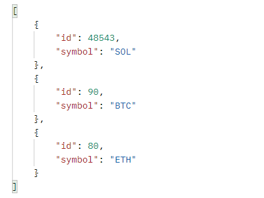
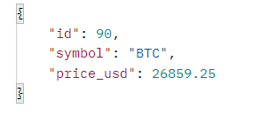
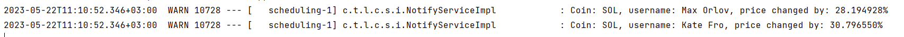
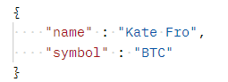
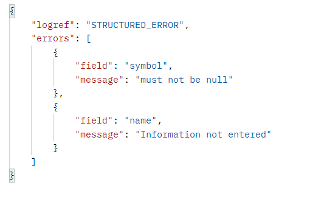

# CryptoCurrency watcher
REST-сервис для просмотра котировок криптовалют.

Список доступных криптовалют предопределен и является частью конфигурации сервера.

Список валют:
[ {“id”:”90”,”symbol”:”BTC”}, {“id”:”80”,”symbol”:”ETH”}, {“id”:”48543”,”symbol”:”SOL”} ].

Раз в минуту актуальные цены для доступных криптовалют запрашиваются c внешнего источника CoinLore и сохраняются в базу данных.
Для этого используется open API https://www.coinlore.com/cryptocurrency-data-api.

Приложение написано с использование Java 17, Spring Boot (MVC, Data JPA, Validation), Hibernate. 

В качестве базы данных используется PostgreSQL.

Система сборки - Maven.

## Endpoints

### GET /crypto

Просмотр списка доступных криптовалют.

Ответ в формате JSON вида:

### GET /crypto/price

Просмотр актуальной цены для указаной криптовалюты. 

Kод валюты (символ) передается пользователем в параметрах запроса.

Ответ в формате JSON вида:

### POST /crypto/notify

Регистрация пользователя и создание "подписки" на переданную им валюту (символ).
В момент регистрации сохраняется текущая цена указанной криптовалюты с привязкой к пользователю. 
Как только актуальная цена для указанной валюты поменялась более чем на 1%, в лог сервера (консоль на текущий момент) 
выводится сообщение уровня WARN, в котором указано: код валюты, имя пользователя и процент изменения цены с момента регистрации.

Сообщение уровня WARN в консоли:

Запрос на регистрацию передается в формате JSON вида:

При успешном оформлении подписки возвращается статус 201 Created.

В случае передачи невалидных данных возвращается статус 400 Bad Request и ответ в формате JSON вида:

